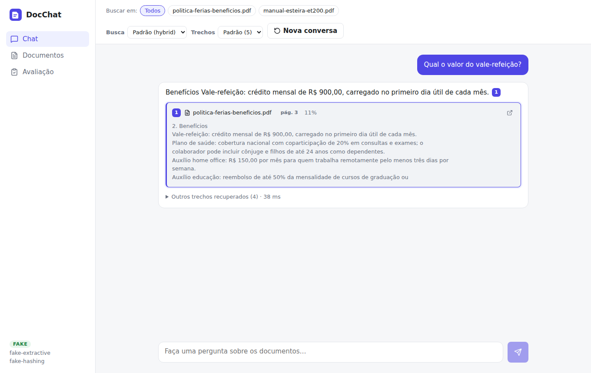
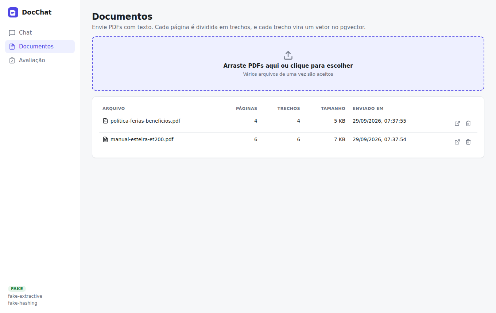
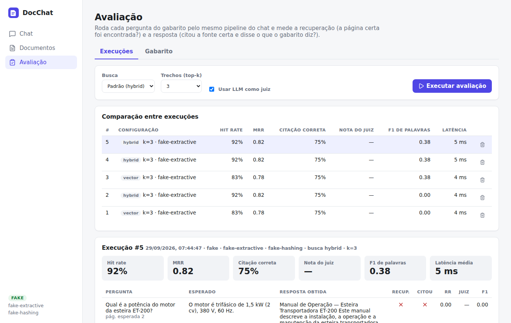
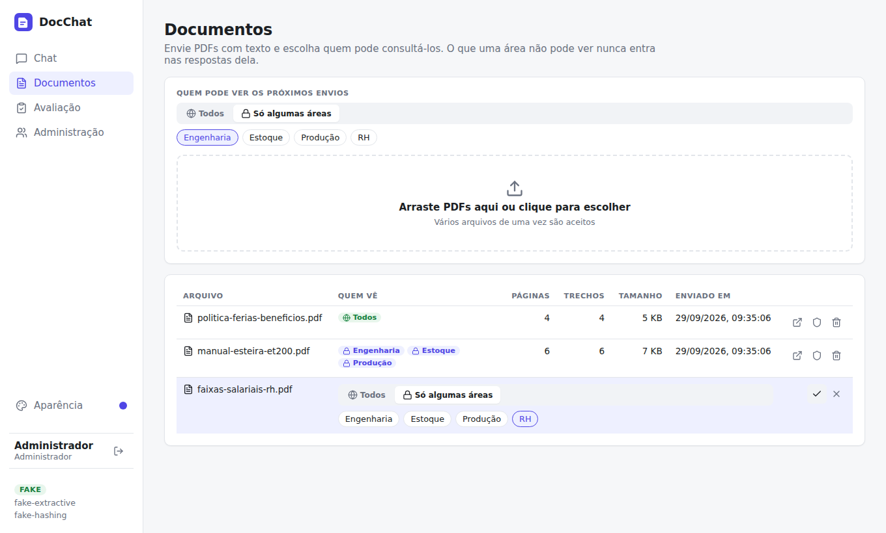
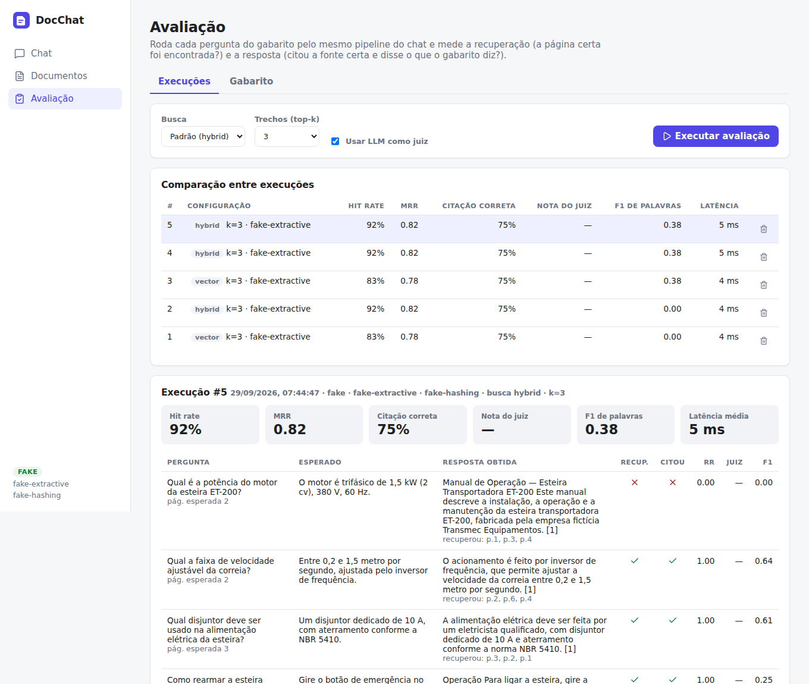
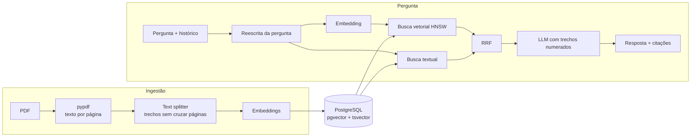

# DocChat

Chat com documentos PDF usando **RAG** (Retrieval-Augmented Generation). Cada resposta indica **de qual
trecho e de qual página** a informação saiu, e uma tela de **avaliação por gabarito** mede se o sistema
está acertando.

Construído com Python, FastAPI, LangChain, PostgreSQL + pgvector e React.



> As capturas foram feitas com o provedor `fake`, que roda sem IA. Com OpenAI ou Ollama, o texto da resposta
> é redigido pelo modelo, mas as fontes e as métricas funcionam do mesmo jeito.

---

## O que o projeto faz

| Recurso | Detalhe |
|---|---|
| **Upload de PDFs** | Extrai o texto página por página, divide em trechos e grava os embeddings no pgvector |
| **Chat com citações** | A resposta marca `[1]`, `[2]`… e cada marcação abre o trecho e a página de onde veio |
| **Abrir na página** | Um clique abre o PDF original direto na página citada |
| **Busca híbrida** | Combina busca vetorial com busca textual do Postgres, fundidas por Reciprocal Rank Fusion |
| **Perguntas de acompanhamento** | "E qual o prazo dela?" é reescrita com base no histórico antes da busca |
| **Controle de acesso por área** | Login, áreas e documentos visíveis para todos ou só para algumas áreas; o filtro é aplicado dentro da busca |
| **Filtro por documento** | Restringe a busca a um ou mais PDFs |
| **Avaliação por gabarito** | Roda perguntas com resposta e página esperadas e mede recuperação e resposta |
| **Comparação de configurações** | Cada execução guarda modelo, top-k e tipo de busca, para comparar lado a lado |
| **Aparência** | Tema claro, escuro ou do sistema e nove cores de destaque, salvos no navegador |
| **Provedor configurável** | OpenAI (ou API compatível), Ollama local e gratuito, ou `fake` para testes |

| Documentos | Gabarito |
|---|---|
|  |  |

---

## Controle de acesso

Cada documento é **global** (visível para todos) ou **compartilhado com algumas áreas**. Um mesmo
documento pode servir a várias áreas: o manual de uma máquina fica visível para Engenharia, Estoque e
Produção, sem duplicar o arquivo, enquanto a tabela salarial fica só com o RH.

| Papel | Pode |
|---|---|
| **Leitor** | Perguntar e abrir os documentos globais e os das suas áreas |
| **Administrador** | Ver tudo, enviar e excluir documentos, definir quem vê cada um, cadastrar usuários e áreas, rodar avaliações |

A restrição **não depende do prompt**. Ela é uma condição dentro da consulta SQL da busca vetorial e
da busca textual, então um trecho que o usuário não pode ver nunca é recuperado e nunca chega ao modelo.
Não existe pergunta capaz de fazer o modelo revelar um texto que ele não recebeu. O mesmo filtro vale para
a lista de documentos e para o download do PDF: um documento de outra área responde `404`, como se não
existisse.

- Senhas com `scrypt` (biblioteca padrão do Python), com sal por usuário
- Sessão com JWT assinado, com validade configurável (`TOKEN_HOURS`)
- O primeiro administrador é criado a partir do `.env` (`ADMIN_USERNAME` / `ADMIN_PASSWORD`)



---

## Avaliação

Na maioria dos projetos de RAG, a qualidade é avaliada no olho. Aqui ela é medida.

O gabarito é uma lista de perguntas com a resposta esperada e a página onde ela está. Cada execução passa
todas as perguntas pelo **mesmo pipeline do chat** e mede as duas metades do RAG separadamente, porque cada
uma falha de um jeito diferente:

| Métrica | Mede | Pergunta que responde |
|---|---|---|
| **Hit rate@k** | Recuperação | A página certa apareceu entre os *k* trechos buscados? |
| **MRR** | Recuperação | Em que posição ela apareceu? (1 se em 1º, 0,5 se em 2º…) |
| **Citação correta** | Geração | A resposta citou um trecho da página esperada? |
| **Nota do juiz** | Geração | Um LLM compara a resposta com o gabarito e dá uma nota de 0 a 1 |
| **F1 de palavras** | Geração | Sobreposição de palavras com o gabarito, sem depender de LLM |

Se o hit rate está baixo, o problema está na busca (tamanho dos trechos, modelo de embedding, top-k).
Se o hit rate está alto e a citação ou a nota estão baixas, o problema está no prompt ou no modelo de chat.



O gabarito pode ser montado na tela ou importado em JSON:

```json
[
  {
    "question": "Qual o prazo de garantia do equipamento?",
    "expected_answer": "12 meses a partir da data da nota fiscal.",
    "document": "manual-esteira-et200.pdf",
    "expected_page": 5
  }
]
```

---

## Arquitetura



```
backend/
  app/
    config.py        configurações por variável de ambiente
    providers.py     fábrica de modelos: OpenAI, Ollama ou fake
    access.py        regra de visibilidade usada em todas as consultas
    auth.py          login, token e papéis nas rotas
    security.py      hash de senha e JWT
    ingestion.py     leitura do PDF, chunking por página, embeddings
    retrieval.py     busca vetorial, textual e fusão RRF
    rag.py           reescrita da pergunta, prompt, extração das citações
    evaluation.py    métricas, LLM como juiz e execução do gabarito
    routers/         endpoints REST (login, administração, documentos, chat, avaliação)
  tests/             testes unitários e de API com Postgres real
frontend/
  src/pages/         Login, Chat, Documentos, Avaliação e Administração
samples/             PDFs fictícios de exemplo e gabarito
```

### Decisões técnicas

**Trechos nunca cruzam páginas.** O texto é dividido página por página, então todo trecho pertence a
exatamente uma página e a citação aponta a página certa, sem estimativa.

**Busca híbrida em vez de só vetorial.** Embeddings entendem sentido, mas erram termos exatos como códigos
(`F02`), normas (`NBR 5410`) e valores. A busca textual do Postgres cobre esses casos, e a
[Reciprocal Rank Fusion](https://plg.uwaterloo.ca/~gvcormac/cormacksigir09-rrf.pdf) junta os dois rankings
sem precisar calibrar pesos. A tela de avaliação permite comparar os dois modos no mesmo gabarito.

**Um banco só.** Vetores, texto completo, documentos e resultados de avaliação ficam no mesmo PostgreSQL.
O índice HNSW do pgvector faz a busca por similaridade e uma coluna `tsvector` gerada pelo próprio banco
faz a busca textual. Não há um banco vetorial separado para operar.

**Provedor atrás de uma fábrica.** O resto do código não sabe se está falando com OpenAI, Ollama ou o
provedor `fake`. O `fake` usa embeddings por hashing e uma resposta extrativa, o que permite testar o
pipeline inteiro sem chave de API e sem rede.

**O modelo só pode usar os trechos.** O prompt exige citação `[n]` em cada afirmação e uma frase fixa quando
a resposta não está nos documentos. As citações são extraídas da resposta e validadas contra os trechos
enviados. Números inventados pelo modelo são descartados.

---

## Tecnologias

| Camada | Stack |
|---|---|
| Back-end | Python 3.12, FastAPI, LangChain, SQLAlchemy 2, pypdf, PyJWT |
| Banco | PostgreSQL 16, pgvector (HNSW), full-text search em português |
| IA | OpenAI (`gpt-4o-mini`, `text-embedding-3-small`) ou Ollama (`llama3.1`, `nomic-embed-text`) |
| Front-end | React 18, TypeScript, Vite, React Router |
| Testes | pytest, com Postgres + pgvector reais |
| Infra | Docker Compose, nginx, GitHub Actions |

---

## Como rodar

### Com Docker (recomendado)

Requisito: Docker Desktop.

```bash
cp .env.example .env         # escolha o provedor e informe a chave, se for OpenAI
docker compose up -d --build
docker compose exec backend python -m app.seed   # opcional: carrega os PDFs de exemplo e o gabarito
```

Abra **http://localhost:8080**. A documentação da API fica em **http://localhost:8000/docs**
(use o botão *Authorize* com um usuário e senha).

O seed cria uma empresa de exemplo:

| Usuário | Senha | Vê |
|---|---|---|
| `admin` | a do `ADMIN_PASSWORD` (padrão `admin`) | Tudo |
| `engenharia` | `demo1234` | Benefícios e manual da esteira |
| `estoque` | `demo1234` | Benefícios e manual da esteira |
| `rh` | `demo1234` | Benefícios e faixas salariais |

Pergunte "qual a faixa salarial do engenheiro de automação pleno?" entrando como `rh` e depois como
`estoque`, para ver o controle de acesso funcionando.

#### Usando Ollama (gratuito e local)

Com o [Ollama](https://ollama.com) instalado na máquina:

```bash
ollama pull llama3.1:8b
ollama pull nomic-embed-text
```

No `.env`, use `LLM_PROVIDER=ollama` e `OLLAMA_BASE_URL=http://host.docker.internal:11434`.

Para rodar o Ollama também em contêiner, use `docker compose --profile ollama up -d`, faça o `pull` dos
modelos com `docker compose exec ollama ollama pull ...` e use `OLLAMA_BASE_URL=http://ollama:11434`.

> Cada provedor gera vetores de um tamanho (OpenAI 1536, `nomic-embed-text` 768). Ao trocar de provedor,
> recrie o banco com `docker compose down -v` e envie os documentos de novo. A API avisa na inicialização
> se as dimensões não baterem.

### Sem Docker (desenvolvimento)

Requisitos: Python 3.11+, Node 22 e um PostgreSQL com a extensão pgvector
(o jeito mais simples é `docker compose up -d db`).

```bash
# back-end
cd backend
python -m venv .venv
.venv\Scripts\activate          # Windows  (Linux/Mac: source .venv/bin/activate)
pip install -r requirements-dev.txt
uvicorn app.main:app --reload   # lê o .env da raiz do projeto

# front-end, em outro terminal
cd frontend
npm install
npm run dev                     # http://localhost:5173
```

### Testes

```bash
cd backend
pytest
```

Os testes usam o provedor `fake` e um banco `docchat_test` (configurável com `TEST_DATABASE_URL`).
Os testes de API são pulados se não houver Postgres disponível. No CI, o GitHub Actions sobe um contêiner
com pgvector e roda tudo, junto com o lint (ruff) e o build do front-end.

---

## Configuração

Todas as opções ficam no `.env` (veja [`.env.example`](.env.example)):

| Variável | Padrão | Descrição |
|---|---|---|
| `LLM_PROVIDER` | `openai` | `openai`, `ollama` ou `fake` |
| `OPENAI_BASE_URL` | — | Permite usar qualquer API compatível com a da OpenAI |
| `CHUNK_SIZE` / `CHUNK_OVERLAP` | `1000` / `150` | Tamanho e sobreposição dos trechos, em caracteres |
| `TOP_K` | `5` | Quantos trechos são enviados ao modelo |
| `SEARCH_MODE` | `hybrid` | `hybrid` ou `vector` |
| `EMBEDDING_DIM` | do provedor | Dimensão dos vetores |
| `ADMIN_USERNAME` / `ADMIN_PASSWORD` | `admin` / `admin` | Primeiro administrador, criado com o banco vazio |
| `SECRET_KEY` | valor de desenvolvimento | Chave que assina os tokens. Troque fora da sua máquina |
| `TOKEN_HOURS` | `8` | Validade do login |

## API

| Método | Rota | Descrição |
|---|---|---|
| `GET` | `/api/health` | Provedor e modelos em uso (pública) |
| `POST` | `/api/auth/login` | Login (formulário OAuth2), devolve o token |
| `GET` | `/api/auth/me` | Usuário logado e suas áreas |
| `GET` `POST` `PUT` `DELETE` | `/api/areas` | Áreas (escrita só para administradores) |
| `GET` `POST` `PUT` `DELETE` | `/api/users` | Usuários (só administradores) |
| `GET` `POST` | `/api/documents` | Lista os documentos visíveis e envia PDFs com `is_global` e `area_ids` |
| `PUT` | `/api/documents/{id}/access` | Muda quem pode ver o documento |
| `GET` | `/api/documents/{id}/file` | PDF original |
| `DELETE` | `/api/documents/{id}` | Remove o documento e seus trechos |
| `POST` | `/api/chat` | Pergunta, com histórico, filtro de documentos, `top_k` e modo de busca |
| `GET` `POST` `PUT` `DELETE` | `/api/eval/cases` | Gabarito |
| `POST` / `GET` | `/api/eval/cases/import` / `export` | Importa e exporta o gabarito em JSON |
| `GET` `POST` `DELETE` | `/api/eval/runs` | Executa e consulta avaliações |

## Próximos passos

- Prompt específico por área (foco em quantidades para o Estoque, em especificações para a Engenharia)
- Consulta a dados estruturados (lista de materiais, estoque) por *function calling*
- Migrações de banco com Alembic
- Resposta em streaming (SSE)
- OCR para PDFs escaneados
- Reranking dos trechos com um cross-encoder
- Processamento de uploads grandes em fila

## Licença

MIT
